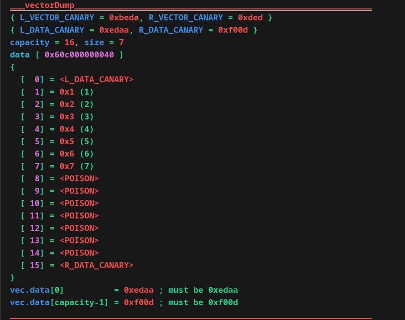

<div align="center">
  
  
  # 🛡️ Vector Implementation in C (C++)
  
  
  
</div>

## 🚀 Quick Start
To build the project:
```cpp
git clone https://github.com/BulgakovDmitry/vector
cd vector
make run
./structVector.out
```
## 🔍 Overview
Structure definition:
```cpp
struct Vector
{
    V_CAN_PR(Canary_t leftVectorCanary;)   // left canary catches buffer overruns

    size_t   coefCapacity;   // capacity-growth factor
    uint64_t errorStatus;    // bitmask that stores error flags

    void** data;             // buffer of elements
    size_t size;             // current element count
    size_t capacity;         // total capacity of the buffer

#ifdef VECTOR_HASH_PROTECTION
    uint64_t dataHashSum;    // hash of data[0 … capacity-1]
    uint64_t vectorHashSum;  // hash of all structure fields
#endif

    V_CAN_PR(Canary_t rightVectorCanary;)  // right canary symmetric guard
};
```

| Implementation Feature       | Purpose                        |
|-------------------------|-----------------------------------|
| `Canaries`             | Detect buffer overflows     |
| `Verifier`             | Check stack integrity       |
| `POISON values`        | Detect uninitialized access |
| `Detailed dump`        | Error state visualization   |
| `Hash protection`      | Data change detection       |

This program also has a convenient console dump for data tracking and debugging
<div align="center">
    
</div>

## 📂 Project Structure
```txt
vector/
├── headers/              # Header files
│   ├── vector.hpp        # Public API and Vector structure
│   └── configFile.hpp    # Protection options (canary / hash / debug)
├── src/                  # Source files
│   ├── vector.cpp        # Container implementation
│   └── main.cpp          # Usage example / test
├── myLib/                # Utility helpers (colours, hash functions, etc.)
└── docs/                 # Images & documentation
```

## 💡 Usage example:
```cpp
#include "../headers/vector.hpp"

int main()
{
    Vector vec = {};
    vectorCtor(&vec);
    
    for (int i = 1; i < 8; i++)
        vectorPush(&vec, (VectorElem_t)(uintptr_t)i);

    printf("%p\n", vectorGet(&vec, 3));

    vectorDump(vec);
    vectorDtor(&vec);
    return 0;
}
```
<div align="center">
  
</div>
